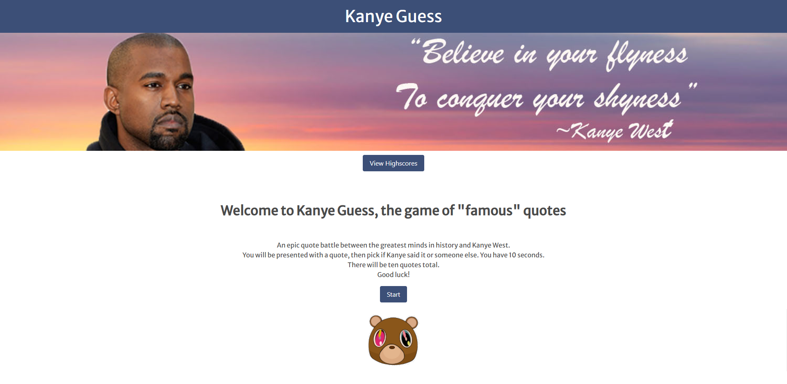

# Kanye Guess Quiz

- Kanye Guess is an interactive quiz game in which users are given a famous quote and must decide within ten seconds if Kanye West said it or someone else. There is a total of ten questions with your score being the number of correct questions answered. Players can add their initials at the end to display in the highscore rankings Hall Of Fame.

## Group Project

- In this project our group will use everything we've learned over the past six weeks to create a real-world front-end application that we’ll be able to showcase to potential employers. The user story and acceptance criteria was developed and articulated by the group, but there were some requirements that we were asked to fulfill.

### 1. Requirements
       • Use a CSS framework other than Bootstrap 
       • Deployed to GitHub Pages
       • Accept and respond to user input
       • Use two server side APIs
       • Does Not use alerts, confirms, or prompts
       • Use client-side storage to store persistent data
       • Be responsive
       • Polished UI
       • Clean repository that follows quality coding standards
       • Have a quality README
       • Must add project to personal portfolio

### 2. User Story
       AS A Game Player
       I WANT to take a timed quiz on Famous Quotes that stores high scores
       SO THAT I can gauge my historical/modern knowledge compared to my peers

### 3. Acceptance Criteria
       GIVEN I am taking the Kanye Guess quiz
       WHEN I click the start button
       THEN a timer starts and I am presented with a quote
       WHEN I click my choice
       THEN I am presented with another quote
       WHEN I answer a question correctly
       THEN my score is incremented
       WHEN all questions are answered 
       THEN the game is over
       WHEN the game is over
       THEN I can save my initials and score

4. created a repository on GitHub at URL https://github.com/Concord511/Quote-Battle

5. This is the address of the live URL: https://concord511.github.io/Quote-Battle/

6. Here is a screenshot of the finished website.

